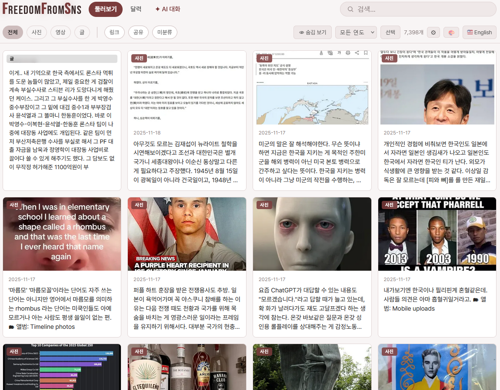
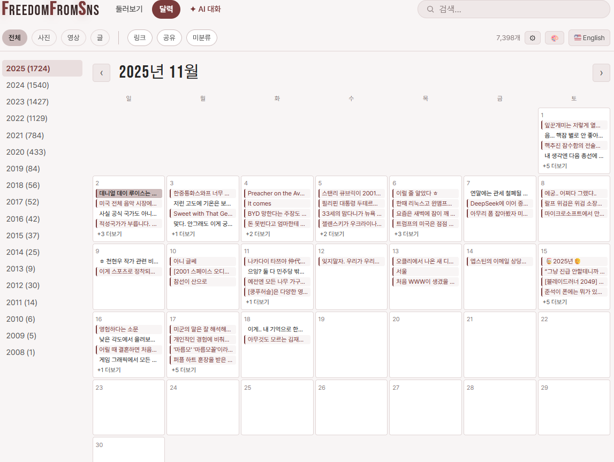
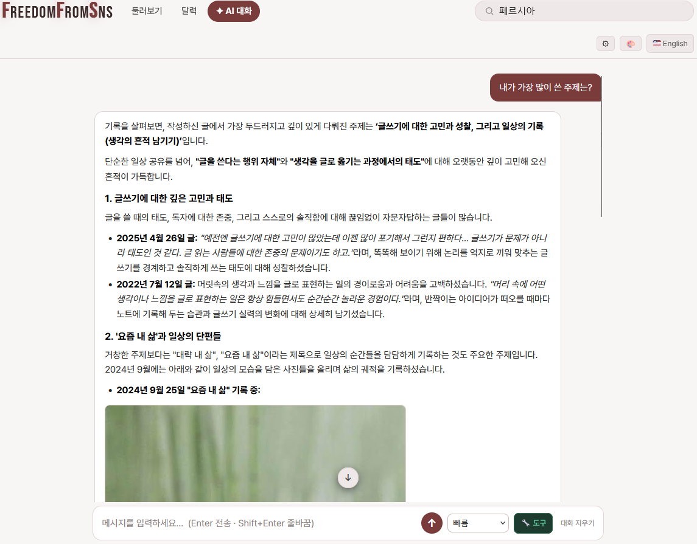

<div align="center">

<picture>
  <source media="(prefers-color-scheme: dark)" srcset="docs/img/logo-dark.svg">
  
</picture>

**페이스북에 흩어진 당신의 기록을, 당신의 컴퓨터에서 되살립니다.**
**Bring your Facebook archive back to life — fast, private, on your own machine.**

<table>
  <tr>
    <td width="50%"><br><sub><b>둘러보기 · Browse</b></sub></td>
    <td width="50%"><br><sub><b>달력 · Calendar</b></sub></td>
  </tr>
  <tr>
    <td width="50%"><br><sub><b>검색 · Search</b></sub></td>
    <td width="50%"><br><sub><b>AI 대화 · AI chat</b></sub></td>
  </tr>
</table>

</div>

---

# 한국어

## FreedomFromSNS란?

페이스북에서 내려받은 **"내 정보 다운로드"(JSON)** 데이터를 **내 컴퓨터에서** 빠르고 사적으로 둘러보는 도구입니다. 페이스북 계정에 다시 로그인하지 않아도, 내가 올린 **사진·영상·글**이 검색 가능한 타임라인으로 되살아납니다. 아무것도 외부로 나가지 않고, 원본 내보내기 파일은 **읽기 전용**으로 절대 수정하지 않습니다.

네 가지 원칙 — **단순함, 속도, 편리함, 그리고 "내가 만든 것"에 집중**:

- 기본 피드(**전체**)는 *내가* 올린 콘텐츠입니다. 남의 글을 퍼온 **공유**, 외부 **링크**, **미분류** 미디어는 메인 타임라인을 어지럽히지 않도록 눌러서 들어가는 별도 칸으로 모아둡니다.
- 2만 개가 넘는 글도 즉각적으로 느껴지도록 — 그리드·달력·검색은 미리 계산된 스냅샷에서 브라우저가 바로 그립니다.

## 주요 기능

- **둘러보기 & 달력** — 한눈에 보는 그리드, 그리고 연·월 달력으로 그날그날의 기록 탐색.
- **카테고리** — 전체 · 사진 · 영상 · 글 · 링크 · 공유 · 미분류.
- **전체화면 갤러리** — 사진 한 장을 열면 그 **카테고리 전체(수천 장)** 를 좌우로 넘겨봅니다. 한 게시물의 사진 몇 장에 갇히지 않습니다.
- **검색** — 즉각적인 **키워드 검색(키 불필요)** + 의미로 찾는 **시맨틱 검색**(선택).
- **AI 대화** — 내 *실제* 글과 사진을 근거로 답하는 채팅. URL을 지어내지 않고 진짜 사진을 찾아 보여줍니다(선택 — Gemini · DeepSeek 등 무료/유료 AI API 키 필요).
- **링크 미리보기 · 영상 포스터 · 라이트박스 스크러버** — 디스크에 캐시되어 빠릅니다.
- **36가지 테마**, 라이트/다크 · **한국어·English** UI.
- **사생활 보호** — 전부 로컬에서 동작, 내보내기 파일은 읽기 전용, 글을 숨기거나 비공개로 태그(데이터는 지워지지 않음).

### 단계별 잠금 해제 — 필요한 만큼만

각 단계는 선택이며, 아래 단계를 막지 않습니다.

| 단계 | 무엇을 | 필요한 것 |
|---|---|---|
| **0 — 내 아카이브** | 둘러보기 · 필터 · 타임라인 · **키워드 검색** | 아무것도 (키·다운로드 불필요) |
| **1 — 똑똑한 검색** | 의미 기반(시맨틱) 검색 | 앱에서 선택: 로컬 모델 1회 다운로드(키 불필요) **또는** 무료 AI API 키(예: Gemini) |
| **2 — AI 대화** | 내 기록과 대화 | AI API 키 — Gemini · DeepSeek 등 **무료 또는 유료** |

## 한계 및 알아둘 점

이 한계들은 버그가 아니라 페이스북이 내보내기에 **무엇을 넣고 빼는지**에서 비롯됩니다.

- **공유(리셰어)한 게시물은 대부분 보이지 않습니다.** 페이스북 내보내기 데이터에는 남의 글을 공유할 때의 원본 링크·내용이 거의 들어 있지 않습니다. 데이터만으로는 복원할 수 없고, 실제 페이스북 페이지를 직접 스캔해야 하는데 페이스북이 이를 최대한 어렵게 막아 두었습니다. (그래서 공유는 메인 타임라인 대신 별도 **공유** 칸에 모아 둡니다.)
- **공개 범위·"나만 보기" 설정은 내보내기에 포함되지 않습니다.** 그래서 모든 글이 일단 표시되며, 숨기고 싶은 글은 앱에서 직접 **숨김/비공개**로 표시해야 합니다. 페이스북이 의도적으로 가리는 정보가 많아 자동 분류·연동에는 한계가 있습니다 — 계속 연구 중입니다.

## 설치

한 줄이면 끝입니다. `uv`가 파이썬까지 알아서 관리하므로 파이썬·가상환경·ffmpeg를 따로 설치할 필요가 없습니다. **설치 명령 + 페이스북 데이터**만 있으면 되고, API 키는 선택입니다.

**Windows — 가장 쉬운 방법(더블클릭):** [최신 릴리스](https://github.com/definekorea/freedomfromsns/releases/latest)에서 **`install-ffs.bat`** 파일을 내려받아 **더블클릭**하세요. 파이썬·uv·pip를 미리 깔 필요가 전혀 없습니다 — 설치 프로그램이 uv(작은 도구), 알맞은 파이썬, 앱을 모두 알아서 받습니다. 업데이트하려면 같은 파일을 다시 더블클릭하면 됩니다. (제거: `ffs uninstall` 또는 **`uninstall-ffs.bat`** — 데이터는 보존.)
> 브라우저가 `.bat` 다운로드를 경고할 수 있습니다("유지" / "추가 정보 → 실행") — 서명되지 않은 설치 프로그램이라 정상입니다.

**Windows — 명령 한 줄(PowerShell 또는 cmd):**
```powershell
powershell -ExecutionPolicy ByPass -c "irm https://raw.githubusercontent.com/definekorea/freedomfromsns/master/install-ffs.ps1 | iex"
```

**macOS / Linux / WSL:**
```bash
curl -fsSL https://raw.githubusercontent.com/definekorea/freedomfromsns/master/install-ffs.sh | sh
```
> 윈도우에서 WSL을 쓴다면, 위 네이티브 방법 대신 WSL 터미널에서 이 리눅스 명령을 그대로 실행해도 됩니다. 이 두 가지로 모든 경우가 해결됩니다.

## 사용법

1. **페이스북 데이터 내려받기** — [어카운트 센터](https://accountscenter.facebook.com) → **내 정보 및 권한** → **정보 내보내기(Export your information)** → **내보내기 만들기**:
   - 프로필(Facebook) 선택 → **기기로 내보내기(Export to device)**
   - **형식(Format): JSON** ← HTML 아님, 꼭 **JSON**으로!
   - **기간(Date range): 전체 기간(All time)**
   - **정보 종류:** 기본값 그대로 두면 됩니다(활동 로그류만 빠져 있고 나머지는 선택돼 있음). 이 앱엔 최소한 **게시물(Posts)** 만 있으면 됩니다.
   - 미디어 화질은 **높음(High)** 권장 — 사진·영상이 선명합니다.
   - **내보내기 시작** → 준비되면 이메일이 옵니다. **보통 1~3일** 걸릴 수 있으니 미리 신청해 두세요. 받은 **`.zip`** 은 풀어도 되고 그대로 둬도 됩니다 — 마법사가 알아서 처리합니다.
2. **설치 명령 실행** — 위 한 줄. 마법사가 **언어를 묻고(한국어/English)**, 다운로드 폴더에서 **.zip이든 풀어 둔 폴더든 자동으로 찾습니다**. zip은 `~/ffs/data`에 풀고, 이미 풀어 둔 폴더는 **그 자리에서 쓰거나 `~/ffs/data`로 옮길지** 물어봅니다(직접 경로를 입력해도 됨). 그런 다음 타임라인을 만들고, **하드웨어를 확인해 스마트 검색**(GPU가 있으면 로컬 모델, 없으면 무료 AI 키)을 켤지 물어본 뒤(건너뛰어도 됨 — 색인은 백그라운드에서 만들어집니다), 브라우저를 엽니다(`http://localhost:8282`) — 키 없이 둘러보기·검색이 바로 됩니다.
3. **(선택) 더 켜기** — 앱 안에서 *똑똑한 검색*(1단계)이나 *AI 대화*(2단계)를 켭니다. AI 대화는 **Gemini · DeepSeek 등 무료 또는 유료 AI API 키**를 설정에서 연결하면 됩니다.

모든 것은 `~/ffs/` 한 폴더에 정리됩니다 — 페이스북 데이터(`~/ffs/data/`), 색인, 아카이브, 설정. **다시 열 때**는 설치 시 바탕화면에 생긴 **FreedomFromSNS 바로가기**를 더블클릭하세요(또는 `ffs serve`). 팁: 페이스북 데이터를 `~/ffs/data`에 넣어두면 마법사가 경로 입력 없이 자동으로 찾습니다. **제거**(데이터는 보존): `ffs uninstall` 후 `uv tool uninstall freedomfromsns`.

친구에게 보여주고 싶다면 앱 상단의 **🌐 (웹에 공개)** 버튼으로 임시 공개 링크(Cloudflare)를 만들 수 있습니다 — 공개 전에 비공개로 둘 글은 비공개로 돌리라고 안내해 줍니다. 내 도메인의 **고정 주소**를 원하면 `ffs tunnel`을 실행하세요(무료 Cloudflare 계정 + 도메인 필요).

---

# English

## What it is

FreedomFromSNS turns your Facebook **"Download Your Information" (JSON)** export into a fast, private, searchable timeline **on your own machine** — no logging back into Facebook. Your **photos, videos, and writing** come back to life, nothing leaves your computer, and the export is treated as **read-only** and never modified.

Four principles — **simplicity, speed, convenience, and a focus on your *own* posts**:

- The default feed (**전체 / All**) is what *you* posted. Reshares (**공유**), outbound **links** (**링크**), and loose media (**미분류**) are tucked into click-into buckets so they never clutter your timeline.
- It feels instant even at 20k+ posts — the grid, calendar, and search render client-side from a precomputed snapshot.

## Features

- **Browse & Calendar** — a grid at a glance, plus a year/month calendar to jump to any day.
- **Categories** — All · Photos · Videos · Writing · Links · Reshares · Uncategorized.
- **Full-screen gallery** — open one photo and swipe through the **whole category (thousands)**, not just the handful on a single post.
- **Search** — instant **keyword search (no key)** plus meaning-based **semantic search** (optional).
- **AI chat** — chat grounded in your *real* posts; it surfaces your actual photos and never invents URLs (optional — needs a free or paid AI API key: Gemini, DeepSeek, etc.).
- **Link previews · video posters · a lightbox scrubber** — cached to disk, fast.
- **36 themes**, light/dark · **Korean & English** UI.
- **Private by construction** — everything runs locally, the export is read-only, and you can hide or mark posts private (data is never deleted).

### Unlock ladder — only as much as you need

Each tier is optional and never blocks the one below it.

| Tier | What | Needs |
|---|---|---|
| **0 — Your archive** | browse · filter · timeline · **keyword search** | nothing (no key, no download) |
| **1 — Smart search** | meaning-based / semantic search | in-app opt-in: a one-time local model (no key) **or** a free AI API key (e.g. Gemini) |
| **2 — Chat with your archive** | talk to your own posts | an AI API key — free or paid (Gemini, DeepSeek, etc.) |

## Limitations & good to know

These come from what Facebook **does and doesn't put in the export** — they aren't bugs.

- **Reshared posts mostly don't appear.** Facebook's export rarely includes the original link or content of a post you shared from someone else, so it can't be reconstructed from the data alone — you'd have to scan the live Facebook page, which Facebook makes as hard as possible. (That's why reshares are collected in a separate **Reshares (공유)** bucket rather than the main timeline.)
- **Audience / "Only me" privacy settings aren't in the export.** So everything is shown by default; hide what you don't want to see with the app's **hide / private** tags. Facebook deliberately withholds a lot, so automatic classification and integrations have limits — an area of ongoing research.

## Install

One line. `uv` manages a pinned Python for you, so there's no Python, venv, or ffmpeg to install by hand. You only need **the install command + your Facebook download**; an API key is optional.

**Windows — easiest (double-click):** download **`install-ffs.bat`** from the [latest release](https://github.com/definekorea/freedomfromsns/releases/latest) and **double-click it**. You don't need Python, uv, or pip first — the installer fetches uv (a tiny tool), the right Python, and the app for you. Double-click the same file again to update. (Uninstall: run `ffs uninstall`, or use **`uninstall-ffs.bat`** — your data is kept.)
> Your browser may warn about a `.bat` download ("Keep" / "More info → Run anyway") — that's expected for an unsigned installer.

**Windows — one line (PowerShell or cmd):**
```powershell
powershell -ExecutionPolicy ByPass -c "irm https://raw.githubusercontent.com/definekorea/freedomfromsns/master/install-ffs.ps1 | iex"
```

**macOS / Linux / WSL:**
```bash
curl -fsSL https://raw.githubusercontent.com/definekorea/freedomfromsns/master/install-ffs.sh | sh
```
> On Windows with WSL, run this Linux command inside your WSL terminal instead of the native step above. These two commands cover every case.

## How to use

1. **Download your Facebook data** — at [Accounts Center](https://accountscenter.facebook.com) → **Your information and permissions** → **Export your information** → **Create export**:
   - pick your profile (Facebook) → **Export to device**
   - **Format: JSON** ← not HTML, must be **JSON**
   - **Date range: All time**
   - **Information types:** the defaults are fine (everything except activity logs is pre-selected); at a minimum keep **Posts** — that's what this app reads.
   - Media quality **High** is recommended (sharper photos/videos).
   - **Start export** → Meta emails you when it's ready. This **often takes 1–3 days**, so request it ahead of time. Leave the **`.zip`** zipped or unzip it — the wizard handles either.
2. **Run the install command** above. The wizard asks your **language (English / 한국어)** and **auto-locates** your export in your Downloads — a `.zip` or an already-extracted folder. A zip is extracted into `~/ffs/data`; an extracted folder is **used in place or moved into `~/ffs/data`** (your choice), or you can type a path yourself. Then it builds your timeline, **checks your hardware and offers smart search** (a local model if you have a GPU, otherwise a free AI key — skippable; the index builds in the background), and opens the browser at `http://localhost:8282` — browsing and keyword search work immediately, no key.
3. **(Optional) Turn on more** — enable *Smart search* (Tier 1) or *Chat* (Tier 2) from inside the app whenever you want. Chat connects a **free or paid AI API key (Gemini, DeepSeek, etc.)** in Settings.

Everything lives in one folder, `~/ffs/` — your Facebook data (`~/ffs/data/`), index, archive, and config. **To reopen it later**, double-click the **FreedomFromSNS** shortcut that install put on your Desktop (or run `ffs serve`). Tip: drop your export in `~/ffs/data` and the wizard finds it with no path typing. **To uninstall** (keeps your data): `ffs uninstall`, then `uv tool uninstall freedomfromsns`.

To show a friend, the **🌐 Publish** button in the app creates a temporary public link (Cloudflare) — it reminds you to set sensitive posts to private first. For a permanent address on your own domain, run `ffs tunnel` (needs a free Cloudflare account + a domain).

### From source (development)

```bash
git clone https://github.com/definekorea/freedomfromsns && cd freedomfromsns
python3 -m venv .venv && . .venv/bin/activate
pip install -e .
ffs setup            # or run parse → build → serve by hand (see `ffs --help`)
```

## How it works

```
Facebook JSON export (read-only)
      │  ffs parse → build  (deterministic; no key)
      ▼
~/ffs/  (data/ + index/posts.jsonl + spaces-data/<year>/*.md)
      │  ffs serve
      ▼
one FastAPI process on :8282  →  the single-page viewer
   ├─ /api/index   browse snapshot (grid + calendar, client-rendered)
   ├─ /api/search  keyword + (optional) semantic
   ├─ /api/media   category-wide gallery
   └─ /api/chat    grounded RAG / agentic tool-loop  (optional, needs a key)
```

Built on four principles — see [`docs/principles.md`](docs/principles.md).
Deployment & publishing design: [`docs/deployment-and-publishing.md`](docs/deployment-and-publishing.md).
